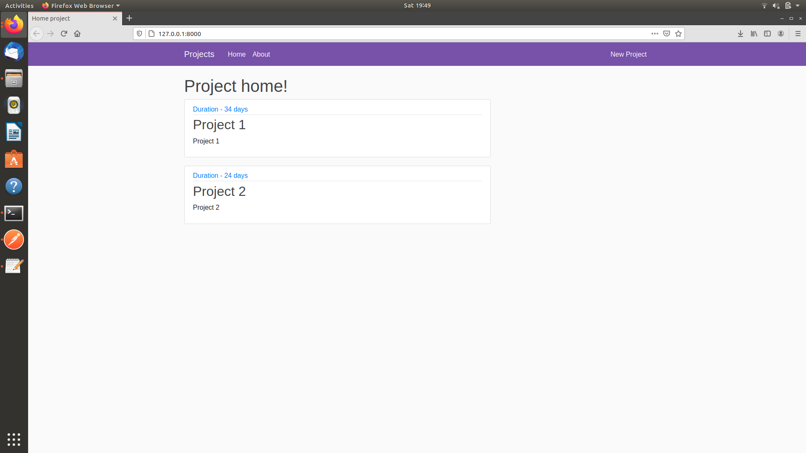

# Project & Task Handler    
A django webapp to manage Projects and Tasks. The web app is csrf protected and has a sqlite database which stores already feeded information and are managed using django ORM (Object-Relational Mapper). 

## Description: 
The webapp is run on Django with a html and jinja template front end. 
The user is give options to -
1. Create new Projects
2. View project details
3. Update and Delete existing projects
4. Create new Tasks inside projects
5. View task details
6. Update and Delete existing Tasks

All the information is stored in the sqlite database and handled with the help of django ORM , Forms are created with the help of predefined <b>class based views.</b> 

## Front_End: 
HTML, CSS, Crispy-Forms, Jinja

## Back_End: 
Python, Django 

## Database 
sqlite3

## Libraries_used: 
django , django-crispy-forms 

## RUN: 

1. Clone the repo   
2. Create environment  
3. pip install -r requirements.txt  
4. Change to crowdfix_project
5. python manage.py runserver

## Benchmark:

## Demo:  

